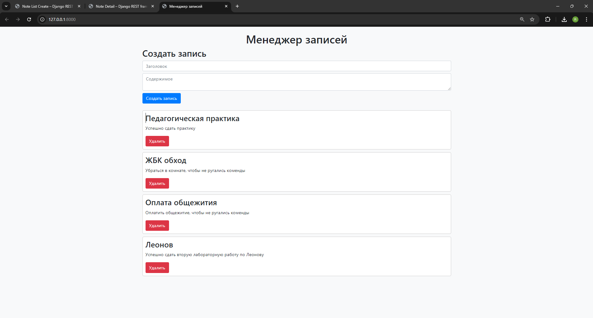
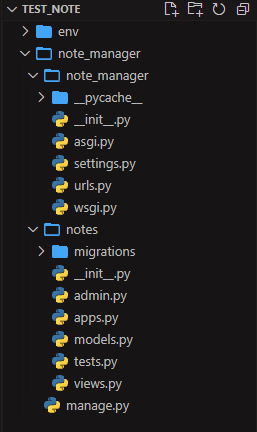
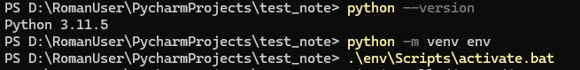
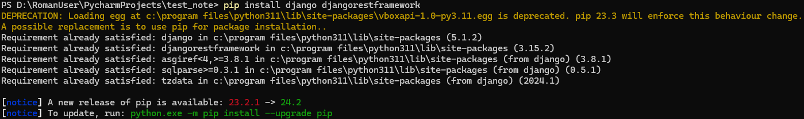
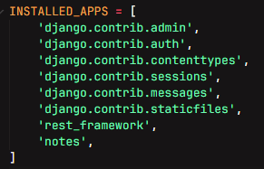
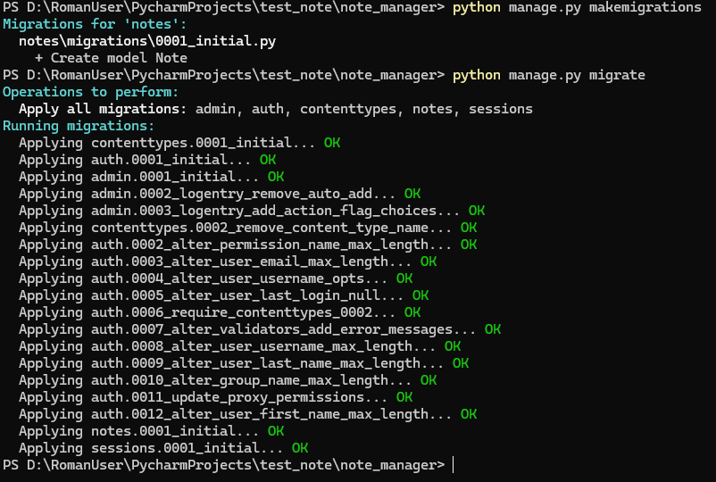
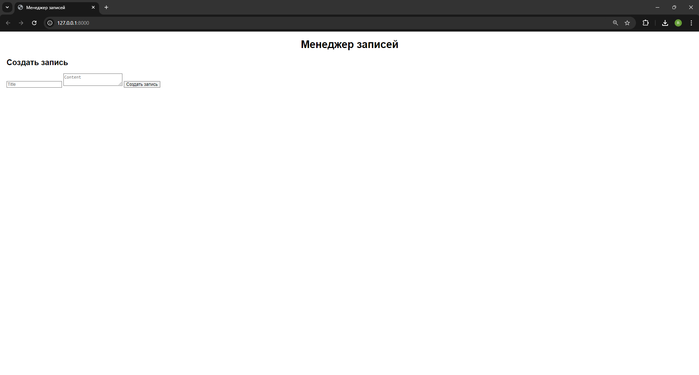
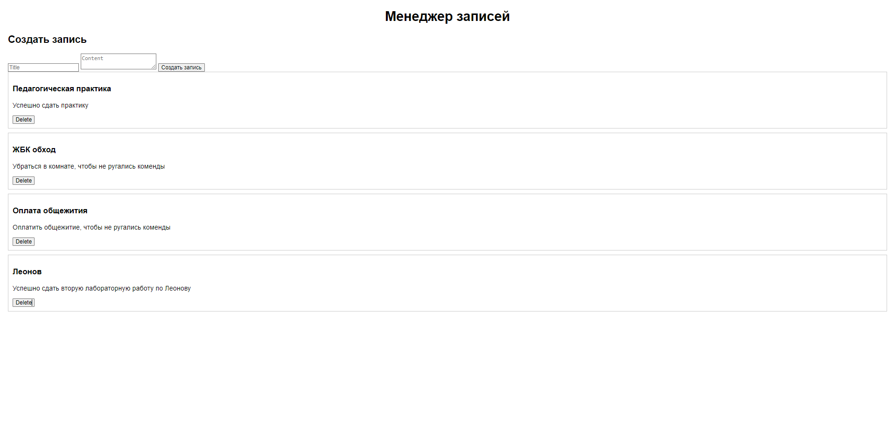
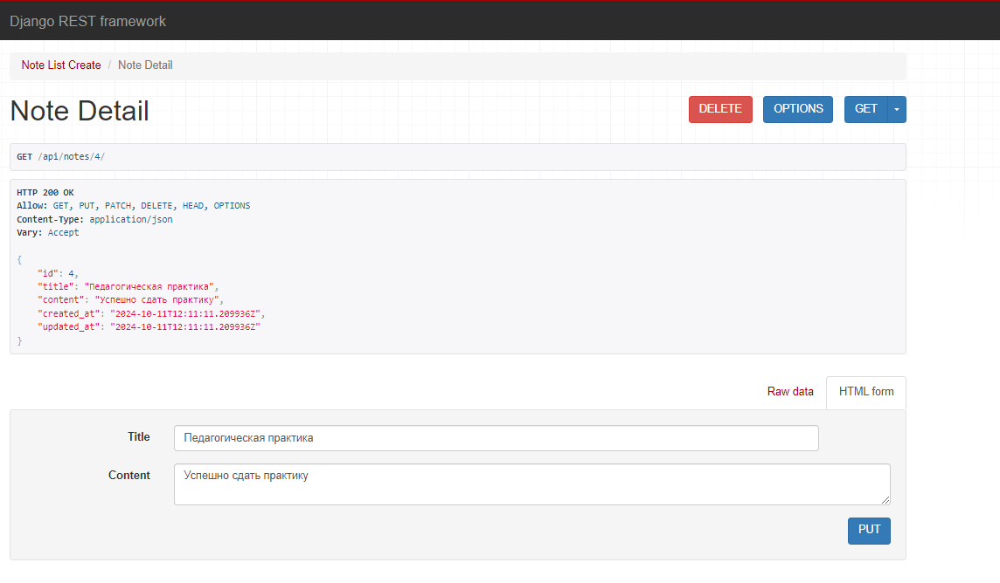

# Note Manager — Веб-приложение на Django

Приложение для создания, просмотра, редактирования и удаления заметок.
<p align="center">
  
</p>

## Описание проекта

Это учебное веб-приложение на Django с использованием Django REST Framework для работы с заметками через API. Интерфейс предоставляет возможности для создания новых заметок, редактирования существующих, а также удаления заметок.

## Стек технологий

- Python 3.11
- Django 5.1.2
- Django REST Framework 3.15.2
- SQLite (встроенная база данных)

## Основные возможности

- Создание, просмотр, редактирование и удаление заметок
- REST API для работы с заметками
- Простое управление через веб-интерфейс
- Статическая подача контента

## Теория и структура Django проекта

Django — это высокоуровневый веб-фреймворк на Python, который позволяет разрабатывать веб-приложения быстро и с минимальным количеством кода. Он следует принципу "DRY" (Don't Repeat Yourself) и использует архитектуру MVT (Model-View-Template).

### Основные компоненты Django проекта:
1. Проект — верхний уровень структуры, содержащий настройки и конфигурацию веб-приложения.
2. Приложения (Apps) — отдельные модули внутри проекта, каждый из которых отвечает за конкретную функциональность и может быть использован в других проектах.

### Стандартная структура Django проекта:
<p align="center">
  
</p>

### Описание основных файлов и директорий

- **manage.py** — Скрипт для взаимодействия с проектом. Используется для выполнения команд, таких как запуск сервера, миграции и управление базой данных.
- **settings.py** — Файл настроек, где указываются параметры базы данных, установленные приложения, конфигурации безопасности и другие глобальные настройки.
- **urls.py** — Маршрутизация запросов внутри проекта. Определяет, какой view будет обрабатывать определенный URL.
- **models.py** — Файл для определения моделей данных. Модели описывают структуру базы данных.
- **views.py** — В этом файле находится логика обработки запросов и отправки ответов. Это могут быть как обычные представления (view), так и API endpoints.
- **admin.py** — Настройки административной панели Django.
- **serializers.py** — Используется при работе с Django REST Framework для преобразования данных (например, из объектов модели в JSON и обратно).
- **static/** — Папка для хранения статических файлов, таких как CSS, JavaScript и изображения. Статические файлы могут быть как глобальными для всего проекта, так и специфичными для определенного приложения.
- **templates/** — Папка для хранения HTML-шаблонов, используемых для рендеринга данных в браузере.

### MVT Архитектура

- **Model** — Определяет структуру базы данных. Django автоматически создает таблицы на основе моделей.
- **View** — Обрабатывает запросы и возвращает ответ, будь то HTML или JSON данные для API.
- **Template** — Определяет, как информация отображается пользователю. В Django используются шаблоны HTML для рендеринга данных.

## Этапы создания
### Шаг 1: Настройка проекта Django

1. Создадим и активируем виртуальное окружение:
```
python -m venv venv
.\env\Scripts\activate.bat
```
<p align="center">
  
</p>

2. Установим Django и Django REST Framework:
```
pip install django djangorestframework
```
<p align="center">
  
</p>

3. Создадим новый проект Django:
```
django-admin startproject note_manager
cd note_manager
```
4. Создадим новое приложение для заметок
```
python manage.py startapp notes
```
5. Добавим приложение и REST Framework в файл settings.py
```
INSTALLED_APPS = [
    ...,
    'rest_framework',
    'notes',
]
```
<p align="center">
  
</p>

### Шаг 2: Создание модели заметки

1. Откроем файл notes/models.py и создадим модель Note:
```
from django.db import models

class Note(models.Model):
    title = models.CharField(max_length=100)
    content = models.TextField()
    created_at = models.DateTimeField(auto_now_add=True)
    updated_at = models.DateTimeField(auto_now=True)

    def __str__(self):
        return self.title
```
2. Создадим миграции и применим их:
```
python manage.py makemigrations
python manage.py migrate
```
<p align="center">
  
</p>

### Шаг 3: Создание сериализатора для заметок

Сериализатор в Django REST Framework используется для преобразования данных между сложными типами (например, объектами Django моделей) и форматами, которые можно легко преобразовать в JSON, XML или другие типы данных, подходящие для API запросов. Он позволяет контролировать, как данные передаются между клиентом и сервером.

1. Создадим файл notes/serializers.py и добавим следующий код:
```
from rest_framework import serializers
from .models import Note

class NoteSerializer(serializers.ModelSerializer):
    class Meta:
        model = Note
        fields = '__all__'
```

### Шаг 4: Создание представлений для REST API

Создание представлений для REST API необходим для того, чтобы определить, как ваше Django-приложение будет обрабатывать HTTP-запросы к вашему API и возвращать ответы. Представления (views) — это логика, которая связывает клиентские запросы с данными, хранящимися на сервере

1. Откроем файл notes/views.py и добавим следующие представления:
```
from rest_framework import generics
from .models import Note
from .serializers import NoteSerializer

class NoteListCreate(generics.ListCreateAPIView):
    queryset = Note.objects.all()
    serializer_class = NoteSerializer

class NoteDetail(generics.RetrieveUpdateDestroyAPIView):
    queryset = Note.objects.all()
    serializer_class = NoteSerializer
```

### Шаг 5: Настройка URL для REST API

1. Создадим файл notes/urls.py и добавьте следующие маршруты:
```
from django.urls import path
from .views import NoteListCreate, NoteDetail

urlpatterns = [
    path('notes/', NoteListCreate.as_view(), name='note-list-create'),
    path('notes/<int:pk>/', NoteDetail.as_view(), name='note-detail'),
]
```
2. Добавим маршруты приложения в основной файл URL проекта (note_manager/urls.py):
```
from django.contrib import admin
from django.urls import include, path

urlpatterns = [
    path('admin/', admin.site.urls),
    path('api/', include('notes.urls')),
]
```

### Шаг 6: Создание фронтенда
Теперь создадим простую HTML-страницу для работы с нашим API. Мы будем использовать JavaScript для выполнения запросов к API.

1. Создадим папку tamplates в корне нашего проекта и создадим в ней файл index.py:
```
<!DOCTYPE html>
<html lang="en">
<head>
    <meta charset="UTF-8">
    <meta name="viewport" content="width=device-width, initial-scale=1.0">
    <title>Note Manager</title>
    <style>
        body {
            font-family: Arial, sans-serif;
            margin: 20px;
        }
        h1 {
            text-align: center;
        }
        .note {
            border: 1px solid #ccc;
            padding: 10px;
            margin-bottom: 10px;
        }
    </style>
</head>
<body>
    <h1>Note Manager</h1>
    <div>
        <h2>Create Note</h2>
        <input type="text" id="note-title" placeholder="Title">
        <textarea id="note-content" placeholder="Content"></textarea>
        <button onclick="createNote()">Create Note</button>
    </div>
    <div id="notes"></div>

    <script>
        const apiUrl = 'http://127.0.0.1:8000/api/notes/';

        async function fetchNotes() {
            const response = await fetch(apiUrl);
            const notes = await response.json();
            const notesDiv = document.getElementById('notes');
            notesDiv.innerHTML = '';
            notes.forEach(note => {
                notesDiv.innerHTML += `<div class="note">
                    <h3>${note.title}</h3>
                    <p>${note.content}</p>
                    <button onclick="deleteNote(${note.id})">Delete</button>
                </div>`;
            });
        }

        async function createNote() {
            const title = document.getElementById('note-title').value;
            const content = document.getElementById('note-content').value;

            await fetch(apiUrl, {
                method: 'POST',
                headers: {
                    'Content-Type': 'application/json',
                },
                body: JSON.stringify({ title, content }),
            });

            document.getElementById('note-title').value = '';
            document.getElementById('note-content').value = '';
            fetchNotes();  // Обновляем список заметок
        }

        async function deleteNote(id) {
            await fetch(`${apiUrl}${id}/`, {
                method: 'DELETE',
            });
            fetchNotes();  // Обновляем список заметок
        }

        // Загружаем заметки при загрузке страницы
        fetchNotes();
    </script>
</body>
</html>
```

### Шаг 7: Настройка templates
Настройка settings.py: В файле settings.py добавим путь к нашему шаблону:
```
import os

BASE_DIR = os.path.dirname(os.path.dirname(os.path.abspath(__file__)))

TEMPLATES = [
    {
        'BACKEND': 'django.template.backends.django.DjangoTemplates',
        'DIRS': [os.path.join(BASE_DIR, 'notes', 'templates')],  # Добавим этот путь
        'APP_DIRS': True,
        'OPTIONS': {
            'context_processors': [
                'django.template.context_processors.debug',
                'django.template.context_processors.request',
                'django.contrib.auth.context_processors.auth',
                'django.contrib.messages.context_processors.messages',
            ],
        },
    },
]
```
### Шаг 8: Запуск сервера
Запустим сервер и убедимся в работе:
<p align="center">
  
</p>

Отлично, наже приложение заработало. Теперь попробуем добавить пару записе:
<p align="center">
  
</p>

### Пример работы API

Получение всех заметок:

При отправке GET-запроса на http://127.0.0.1:8000/api/notes/, метод NoteListCreate.get() будет вызван, и API вернет список всех заметок в формате JSON.
Создание новой заметки:

При отправке POST-запроса с данными заметки на http://127.0.0.1:8000/api/notes/, метод NoteListCreate.post() будет вызван, и новая заметка будет создана в базе данных.
Обновление заметки:

При отправке PUT-запроса на http://127.0.0.1:8000/api/notes/<id>/ с данными обновленной заметки, метод NoteDetail.put() обновит заметку с указанным идентификатором.
Удаление заметки:

При отправке DELETE-запроса на http://127.0.0.1:8000/api/notes/<id>/, метод NoteDetail.delete() удалит заметку с указанным идентификатором.

<p align="center">
  
</p>
<p align="center">
  
</p>

### Шаг 9: Оптимизация и разделение frontend-части приложения.

Обычно фронтенд часть разделяют на HTML (шаблоны), CSS (стили), JavaScipt (логика поведения). В папке templates хранятся html шаблоны, а в папки static хранятся css и js файлы. Создадим папку static, а в ней style.css и scripts.js.

style.css:
```
body {
    padding: 20px;
    background-color: #f8f9fa;
}
.note {
    border: 1px solid #ccc;
    border-radius: 5px;
    padding: 10px;
    margin-bottom: 10px;
    background-color: white;
}
```
scripts.js:
```
const apiUrl = 'http://127.0.0.1:8000/api/notes/';

async function fetchNotes() {
    const response = await fetch(apiUrl);
    const notes = await response.json();
    const notesDiv = document.getElementById('notes');
    notesDiv.innerHTML = '';
    notes.forEach(note => {
        notesDiv.innerHTML += `<div class="note">
            <h3>${note.title}</h3>
            <p>${note.content}</p>
            <button class="btn btn-danger" onclick="deleteNote(${note.id})">Удалить</button>
        </div>`;
    });
}

async function createNote() {
    const title = document.getElementById('note-title').value;
    const content = document.getElementById('note-content').value;

    await fetch(apiUrl, {
        method: 'POST',
        headers: {
            'Content-Type': 'application/json',
        },
        body: JSON.stringify({ title, content }),
    });

    document.getElementById('note-title').value = '';
    document.getElementById('note-content').value = '';
    fetchNotes();
}

async function deleteNote(id) {
    await fetch(`${apiUrl}${id}/`, {
        method: 'DELETE',
    });
    fetchNotes(); 
}

fetchNotes();
```
После этого, в файле settings.py добавим настройку статический файлов:
```
STATIC_URL = '/static/'

STATICFILES_DIRS = [
    os.path.join(BASE_DIR, 'static'),
]
```
Также, немного изменим наш html шаблон для более красивой реализации:
```
<!DOCTYPE html>

<html lang="en">
<head>
    <meta charset="UTF-8">
    <meta name="viewport" content="width=device-width, initial-scale=1.0">
    <title>Менеджер записей</title>
    <link rel="stylesheet" href="https://stackpath.bootstrapcdn.com/bootstrap/4.5.2/css/bootstrap.min.css">
    <link rel="stylesheet" href="">
</head>
<body>
    <div class="container">
        <h1 class="text-center">Менеджер записей</h1>
        <div class="mb-4">
            <h2>Создать запись</h2>
            <input type="text" id="note-title" class="form-control" placeholder="Заголовок">
            <textarea id="note-content" class="form-control mt-2" placeholder="Содержимое"></textarea>
            <button class="btn btn-primary mt-2" onclick="createNote()">Создать запись</button>
        </div>
        <div id="notes"></div>
    </div>

    <script src=""></script>
</body>
</html>
```
Ну и наконец, запустим наше приложение и посмотрим на результат:
<p align="center">
  
</p>
